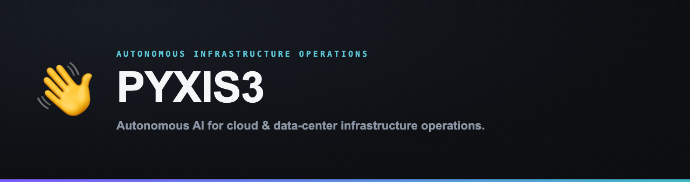

<picture>
  <source media="(prefers-color-scheme: light)" srcset="assets/banner-light.png" />
  
</picture>

production AI & cloud infrastructure · LLM inference serving · Kubernetes-native operations

[Currently](#currently) · [Open source](#open-source) · [Stack](#stack) · [Contact](#contact)

---

## Currently

- **[PYXIS3](https://pyxis3.ai)** ([@pyxis3-ai](https://github.com/pyxis3-ai)) — autonomous AI that runs your cloud and data-center infrastructure operations across AWS, Google Cloud, Azure, VMware, Nutanix, and on-prem, spanning **cost, capacity, reliability, security, and governance**, within your guardrails. One subscription, never a share of savings.

## Open source

Most under [`@pyxis3-ai`](https://github.com/pyxis3-ai):

| Project | What it is |
|---|---|
| [`lens`](https://github.com/pyxis3-ai/lens) | In-cluster Kubernetes observability with in-browser `kubectl exec`. Vue 3 + Bun, single binary, ServiceAccount-token auth — built for ML-serving and GPU clusters. |
| [`vllm-bench`](https://github.com/pyxis3-ai/vllm-bench) | Throughput + latency benchmark for OpenAI-compatible LLM endpoints (vLLM, TGI, llama.cpp, Ollama). TTFT, TPOT, token throughput at percentiles. Async, two dependencies. · *MIT* |
| [`llm-serving-cookbook`](https://github.com/pyxis3-ai/llm-serving-cookbook) | Production recipes for K8s-native vLLM-first serving: vLLM-on-EKS, KEDA autoscaling, token economics, TTFT optimisation, runtime selection. · *Apache-2.0* |
| [`awesome-model-agnostic-llm`](https://github.com/pyxis3-ai/awesome-model-agnostic-llm) | Curated index of model-agnostic LLM tooling: runtimes, routers, evaluators, observability, standards, open weights. · *CC0* |
| [`noor`](https://github.com/pyxis3-ai/noor) | Semantic search over the Quran + Hadith corpus. Arabic-aware multilingual embeddings on `sqlite-vec`. FastAPI + Vue, single Docker image. |
| [`DisplayDeck`](https://github.com/oabdrabo/DisplayDeck) | A tiny macOS menu-bar app for total display control (disable screens, Force HiDPI, EDR brightness, warmth, window tiling, transparency/PiP, keep-awake). Objective-C on private CoreGraphics/SkyLight APIs. · *MIT* |

## Stack

`vLLM` · `Triton` · `Kubernetes` · `KEDA` · `Helm` · `Prometheus` · `Caddy` · `AWS` · `GCP` · `Azure` · `Python` · `Go` · `TypeScript`

## Contact

- **PYXIS3** — [pyxis3.ai](https://pyxis3.ai)
- **Email** — [ops@pyxis3.ai](mailto:ops@pyxis3.ai)

<a href="https://github.com/pyxis3-ai">@pyxis3-ai</a> · building autonomous infrastructure operations

